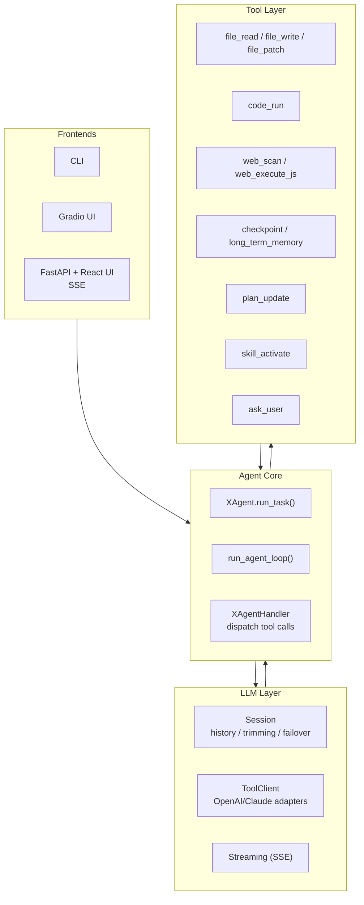
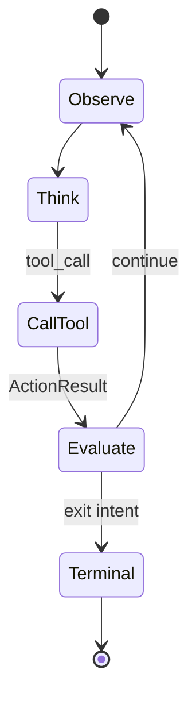
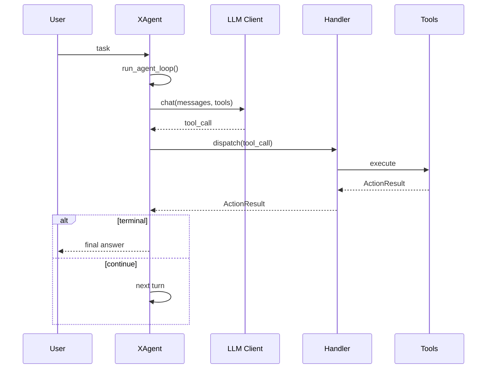

# XAgent 🤖

> A physical-execution agent runtime built around a closed-loop tool-calling cycle.
>
> **Observe first → act with minimal side effects → surface failures clearly → loop until a concrete terminal state.**

[](#-requirements)
[](#-fastapi--react-ui)
[](#-project-status)
[](#-license)

Language: English | [简体中文](README_zh.md)

---

## ✨ Why XAgent

XAgent is designed for tasks that must **touch the real environment**:

- 🗂️ read / write / patch files
- 🧪 run Python or shell commands
- 🌐 inspect and control a browser
- 🙋 ask the user for clarification
- 🧠 maintain short-term checkpoints and long-term memory

It is intentionally **not** a generic chat wrapper. The core is a **tool-call loop** that keeps going until the task reaches a real terminal outcome.

---

## ✅ Highlights

- 🔁 **Explicit control flow**: each tool returns an `ActionResult` (data, next prompt, exit intent, loop flags).
- 🧩 **Multiple model protocols**: text-based tool protocol + native OpenAI/Claude tool-calling clients.
- 🧵 **Session-managed history**: trimming, streaming parsing, failover handled in the LLM layer.
- 🛠️ **Physical toolset**: file ops, code execution, browser scan/JS execution, user interruption, checkpoints, long-term memory settlement, skill activation, plan tracking.
- 🖥️ **Streaming frontends**: CLI, Gradio UI, and FastAPI + React UI with SSE updates.
- 📈 **Observability hooks**: structured event sinks, JSONL logging, optional Langfuse.
- 🧯 **Local-first workspace model**: relative paths resolve under an agent workspace to reduce accidental side effects.

---

## 🧪 Project Status

XAgent is an **early-stage research + engineering project**. The architecture is real and the frontends are runnable, but the public API and configuration may evolve.

⚠️ Treat it as **experimental software**, especially because it can execute code and modify files.

---

## 🧭 Architecture (at a glance)



### 🔄 The tool-call loop (state view)



### 🧵 Main runtime path (sequence view)



Design docs live in [`docs/`](docs/):

- [`docs/architecture.md`](docs/architecture.md)
- [`docs/agent-loop.md`](docs/agent-loop.md)
- [`docs/llm-layer.md`](docs/llm-layer.md)
- [`docs/tool-layer.md`](docs/tool-layer.md)
- [`docs/observability.md`](docs/observability.md)
- [`docs/outlines.md`](docs/outlines.md)

---

## 🗺️ Repository Layout

```text
XAgent/
├── src/
│   ├── core/                 # agent loop, LLM clients, telemetry, skills
│   ├── handler/              # XAgentHandler tool dispatch
│   ├── tools/                # stateless tool implementations
│   ├── assets/               # system prompt, tool schema, code-run header
│   ├── main.py               # CLI entry
│   ├── web_ui.py             # Gradio UI
│   └── web_ui_new.py         # FastAPI backend for React UI
├── frontends/web/            # React + Vite UI
├── docs/                     # design documents
├── memory/                   # persistent memory and SOP files
├── reflect/                  # reflection utilities
├── skills/                   # local prompt skill packs
├── tests/                    # unittest-based coverage
├── pyproject.toml
└── uv.lock
```

Runtime output is expected under `workspace/`, `temp/`, and logs (ignored by Git).

---

## 📦 Requirements

- Python `>=3.12,<3.13`
- [`uv`](https://docs.astral.sh/uv/) (recommended) for Python env management
- Node.js + npm (for React frontend)
- Chrome/Chromium if you use Selenium-backed browser tools
- An OpenAI-compatible or Claude-compatible model endpoint

---

## 🚀 Quick Start

### 1) Install

Create the Python environment:

```bash
uv sync
```

Install optional web/browser dependencies:

```bash
uv sync --extra web
```

### 2) Configure

The simplest setup uses env vars:

```bash
export OPENAI_API_KEY="..."
export OPENAI_BASE_URL="https://api.openai.com/v1/chat/completions"
export OPENAI_MODEL="gpt-4o"
```

You can also provide a JSON config file with one or more named sessions (OpenAI text, Claude text, OpenAI native tools, Claude native tools, failover mixins).

**Tip:** do not commit secrets. Prefer `config.example.json` for shareable defaults.

### 3) Run (CLI)

```bash
.venv/bin/python -m src.main
```

Useful CLI commands:

```text
/help
/session.temperature=0.5
/session.max_tokens=8192
/verbose on
/stop
/exit
```

---

## 🧩 FastAPI + React UI

### Build once, serve from backend

```bash
cd frontends/web
npm install
npm run build
cd ../..
.venv/bin/python -m src.web_ui_new --host 127.0.0.1 --port 7861
```

Open:

```text
http://127.0.0.1:7861/
```

### Dev mode (Vite)

```bash
.venv/bin/python -m src.web_ui_new --host 127.0.0.1 --port 7861
cd frontends/web
VITE_API_BASE=http://127.0.0.1:7861 npm run dev -- --host 127.0.0.1 --port 5173
```

---

## 🎛️ Gradio UI

```bash
.venv/bin/python -m src.web_ui --host 127.0.0.1 --port 7860
```

---

## 🧰 Tools

Tool behavior is declared in [`src/assets/tools_schema.json`](src/assets/tools_schema.json).

| Domain | Tools |
| --- | --- |
| Code execution | `code_run` |
| File operations | `file_read`, `file_write`, `file_patch` |
| Browser operations | `web_scan`, `web_execute_js` |
| User interaction | `ask_user` |
| Memory and planning | `update_working_checkpoint`, `start_long_term_update`, `plan_update` |
| Prompt skills | `skill_activate` |

---

## 🧯 Workspace & Safety Model

By default, XAgent uses `<project_root>/workspace` as the physical workspace. Relative file paths resolve under that workspace.

Safety constraints (high level):

- file ops validate workspace boundaries
- `file_patch` requires **exactly one** match for `old_content`
- code execution runs in a subprocess with timeout handling
- tool outputs are truncated before re-entering the model context
- long-running tasks can be interrupted

---

## 📈 Observability

Enable JSONL logging:

```bash
export XAGENT_LOG_DIR=logs
export XAGENT_LOG_STDERR=1
```

Optional Langfuse integration:

```bash
uv sync --extra observability
.venv/bin/python -m src.main --observability-config observability.example.json
```

---

## 🧠 Skills

Local skills are prompt instruction packs (they do **not** register new executable tools).

Default skill root is [`skills/`](skills/). Each skill contains:

```text
SKILL.md
_meta.json
```

Use a custom skill directory:

```bash
.venv/bin/python -m src.main --skills-dir skills
```

---

## 🧪 Testing

Run Python tests:

```bash
.venv/bin/python -m unittest discover -s tests
```

Run frontend checks:

```bash
cd frontends/web
npm run build
npm run lint
```

---

## 🗓️ Roadmap

- 🔐 stronger permission model for high-risk tools
- 🧪 more complete frontend testing
- 🧰 CI for Python + frontend checks
- 📦 packaged release workflows
- 🧾 more complete configuration examples

---

## 🤝 Contributing

Contributions are welcome.

- Keep diffs small and focused.
- Read `docs/` before changing loop behavior, tool contracts, or protocol adapters.
- Add tests for changes affecting loop exits, history, tool contracts, path safety, streaming, or event delivery.

If you plan a larger change, open an issue first.

---

## 📄 License

This project is licensed under the **MIT License**. See [`LICENSE`](LICENSE).

---

## 🙏 Acknowledgements

Inspired by modern agent runtimes and tool-calling systems (e.g. LangChain, AutoGen, and the broader open-source LLM tooling ecosystem).

<!-- 📸 Optional: add screenshots/GIFs here once available -->
<!-- Example:


-->
