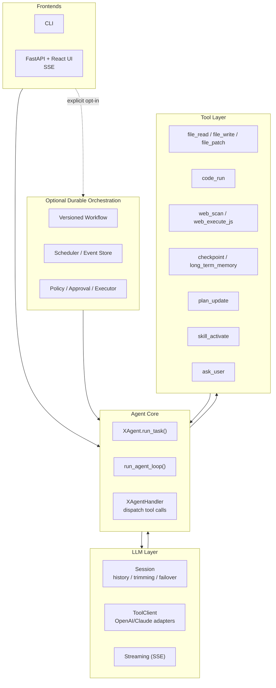
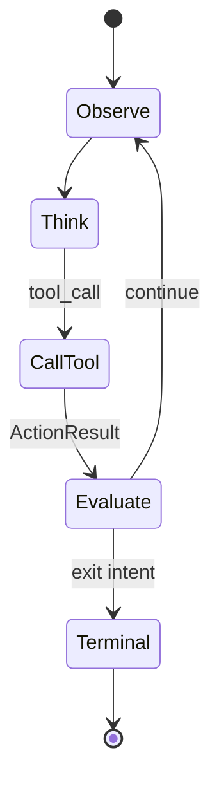
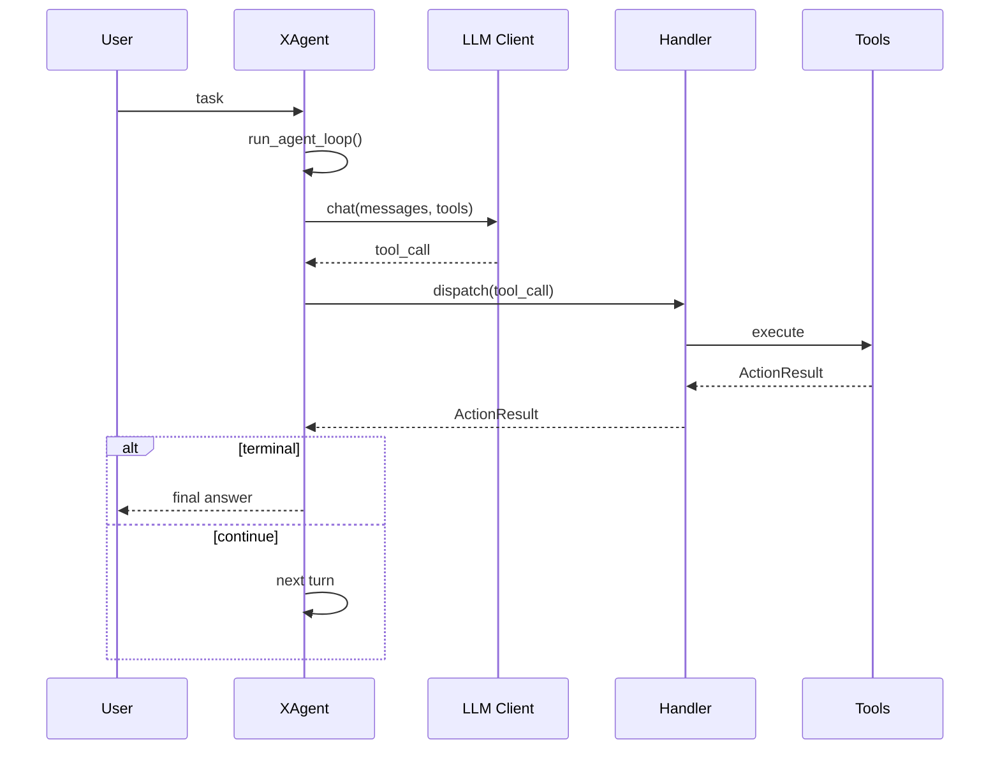

# XAgent 🤖

> A physical-execution agent runtime built around a closed-loop tool-calling cycle.
>
> **Observe first → act with minimal side effects → surface failures clearly → loop until a concrete terminal state.**

[](#-requirements)
[](#-fastapi--react-ui)
[](#-project-status)
[](#-license)

Language: English | [简体中文](README_zh.md)

---

## ✨ Why XAgent

XAgent is designed for tasks that must **touch the real environment**:

- 🗂️ read / write / patch files
- 🧪 run Python or shell commands
- 🌐 inspect and control a browser
- 🙋 ask the user for clarification
- 🧠 maintain short-term checkpoints and long-term memory

It is intentionally **not** a generic chat wrapper. The core is a **tool-call loop** that keeps going until the task reaches a real terminal outcome.

---

## ✅ Highlights

- 🔁 **Explicit control flow**: each tool returns an `ActionResult` (data, next prompt, exit intent, loop flags).
- 🧩 **Multiple model protocols**: text-based tool protocol + native OpenAI/Claude tool-calling clients.
- 🧵 **Session-managed history**: trimming, streaming parsing, failover handled in the LLM layer.
- 🛠️ **Physical toolset**: file ops, code execution, browser scan/JS execution, user interruption, checkpoints, long-term memory settlement, skill activation, plan tracking.
- 🖥️ **Streaming frontends**: CLI and FastAPI + React UI with SSE updates.
- 📈 **Observability hooks**: structured event sinks, JSONL logging, optional Langfuse.
- 🧯 **Local-first workspace model**: relative paths resolve under an agent workspace to reduce accidental side effects.

---

## 🧪 Project Status

XAgent is an **early-stage research + engineering project**. The architecture is real and the frontends are runnable, but the public API and configuration may evolve.

⚠️ Treat it as **experimental software**, especially because it can execute code and modify files.

---

## 🧭 Architecture (at a glance)



### 🔄 The tool-call loop (state view)



### 🧵 Main runtime path (sequence view)



Design docs live in [`docs/`](docs/):

- [`docs/architecture.md`](docs/architecture.md)
- [`docs/agent-loop.md`](docs/agent-loop.md)
- [`docs/agent-kernel.md`](docs/agent-kernel.md)
- [`docs/llm-layer.md`](docs/llm-layer.md)
- [`docs/tool-layer.md`](docs/tool-layer.md)
- [`docs/observability.md`](docs/observability.md)
- [`docs/outlines.md`](docs/outlines.md)
- [`docs/distributed-execution-adr.md`](docs/distributed-execution-adr.md)
- [`docs/distributed-execution-quickstart.md`](docs/distributed-execution-quickstart.md)

---

## 🧱 Optional Durable Orchestration Control Plane

`src.orchestration` is an opt-in control plane around the existing Agent Core.
Importing it does not start a worker, create storage, or change the default CLI,
FastAPI, React, or Team Workflow behavior.

Its small top-level API exposes the main composition entries for:

- immutable, content-addressed Artifacts, bounded `ArtifactRef` values, and
  conservative recoverable local orphan collection
- versioned declarative Workflows, DAG scheduling, deadlines, leases, fencing,
  pause/cancel/recovery, and bounded parent/child Runs
- a SQLite Domain Event truth with rebuildable projections
- policy, durable approval waiting/resume/rejection, and trusted execution
  gates
- side-effect-free replay, invariant/fault evaluation, and explicit reliability
  evidence
- stateless MCP 2026-07-28 discovery and orchestration tools, with protocol
  metadata and authorization context checked per request; malformed,
  oversized, and over-deep inputs use a separate pre-parse token budget and do
  not consume the normal valid-request budget
- a path-free, session-bound remote-execution reference composition with
  Artifact grants, signed runtime proofs, cancellation receipts, and replay
  evidence

Advanced adapters remain available from their defining
`src.orchestration.<module>` modules. Web projections are deliberately not
imported by the top-level package, so the core API does not require FastAPI.

### Correctness boundary

- Activity Attempts are **at-least-once**. Domain Events and local projections
  commit atomically, but an external side effect and SQLite do not share a
  transaction.
- Idempotent or externally probeable operations may be retried with stable
  identities. An uncertain non-idempotent outcome stops in
  `OUTCOME_UNKNOWN` / `WAITING_RECOVERY`; it is not blindly replayed.
- A legacy `AgentActivity` conservatively wraps the existing multi-turn Agent
  Loop as one opaque Activity. Its internal tool calls do not become verified
  per-tool receipts, so an interrupted legacy Activity cannot claim precise
  tool-level recovery.
- Runtime-created Runs persist the verified immutable Workflow Artifact
  identity. Scheduler cache loss or process restart re-verifies and recompiles
  that exact definition; an external resolver is an override, not a
  correctness requirement. Missing or mismatched definition bytes fail closed.
- `(workflow_id, workflow_version)` has one Store-wide immutable definition
  digest, including Runs created through low-level and child-Run paths.
  Workflow v2 input mappings bind exact Run/upstream Artifact identities into
  the Activity request, with deterministic join order.
- `REQUIRE_APPROVAL` releases the worker lease and durably parks the same
  Attempt. A trusted grant re-schedules it with a higher fencing token;
  rejection or cancellation reaches a terminal state without dispatching the
  backend.
- XAgent does **not** claim exactly-once execution for arbitrary tools, automatic
  rollback of external systems, distributed consensus, or exact restoration of
  process/provider/browser state.
- The remote reference is run-scoped and process-local: it is not a production
  server/pull transport, real mTLS, gVisor, or a heterogeneous fleet
  integration. Its prepared-execution and staged-output registries are also
  process-local. OCI/HMAC evidence demonstrates binding and verification, not
  production sandbox isolation. A fleet claim that fails after admission must
  be reprojected from Store before reassignment.
- Checkpoint summaries and telemetry are useful projections, not execution
  truth. Large or sensitive content crosses the control plane only through
  reviewed Artifact references.
- The Event Store, Artifact root, GC quarantine, and locks must live outside
  every Agent-writable workspace under a separate control-plane service/OS
  identity and must not be mounted into legacy file, code, or browser tools.
  The default Web UI does not auto-mount a durable database. The GET-only Web
  adapter accepts an explicit trusted tenant-to-database resolver for a
  separately deployed projection service; path hiding or same-UID permissions
  are not a security boundary.
- The trusted executor rejects any Sandbox `cwd` or allowed root that overlaps
  the configured Store or Artifact roots before backend execution. This
  composition guard catches unsafe mounts but does not replace OS/container
  isolation.
- Durable Run, Node, Attempt, and Artifact metadata rejects nested
  credential-shaped keys after Unicode/case/separator normalization. It fails
  instead of silently redacting identity-bearing input; secret content belongs
  in a protected Artifact.
- Local Artifact collection is dry-run by default and only treats complete,
  committed `ArtifactRef` values as reachable. Store schema v3 indexes
  canonical references in the same Domain Event transaction and linearizes
  them against a durable per-object GC claim, so a newly committed reference
  cannot point to quarantined bytes. A minimum grace period, a second
  reachability scan, a cross-process GC lock, and same-filesystem quarantine
  keep cleanup conservative and recoverable. This guarantee does not cover
  arbitrary registration outside `DurableRunStore` Event transactions.
  Expired crashed-write temporary files use the same lock and bounded
  quarantine path; the collector never unlinks quarantine content, whose final
  retention remains an explicit operator policy.
- Hierarchy child lookups use indexed, bounded Store queries. Web detail and
  SSE snapshots read Run/Node/Attempt projections from one SQLite snapshot and
  page them with hard response limits. Routine pages do not replay every Run's
  full Event History; full replay verification is an explicit per-Run integrity
  endpoint. That operator endpoint is denied unless the router receives an
  explicit authorizer. Its streaming reducer and live-projection comparison
  share one SQLite read snapshot and have fixed Event-count, cumulative
  canonical-payload-byte, and cooperative wall-time budgets.

Read the [design specification](docs/durable-orchestration-spec.md), run the
[local quickstart](docs/durable-orchestration-quickstart.md) or
[distributed reference quickstart](docs/distributed-execution-quickstart.md),
and review the [fault matrix](docs/durable-orchestration-fault-matrix.md) before
composing this control plane into a deployment.

The smallest runnable composition is:

```bash
.venv/bin/python examples/orchestration_runtime_minimal.py
```

---

## 🗺️ Repository Layout

```text
XAgent/
├── src/
│   ├── core/                 # agent loop, LLM clients, telemetry, skills
│   ├── orchestration/        # optional durable control plane
│   ├── handler/              # XAgentHandler tool dispatch
│   ├── tools/                # stateless tool implementations
│   ├── assets/               # system prompt, tool schema, code-run header
│   ├── main.py               # CLI entry
│   └── web_ui_new.py         # FastAPI backend for React UI
├── frontends/web/            # React + Vite UI
├── docs/                     # design documents
├── memory/                   # persistent memory and SOP files
├── reflect/                  # reflection utilities
├── skills/                   # local prompt skill packs
├── tests/                    # unittest-based coverage
├── pyproject.toml
└── uv.lock
```

Runtime output is expected under `workspace/`, `temp/`, and logs (ignored by Git).

---

## 📦 Requirements

- Python `>=3.12,<3.13`
- [`uv`](https://docs.astral.sh/uv/) (recommended) for Python env management
- Node.js + npm (for React frontend)
- Chrome/Chromium if you use Selenium-backed browser tools
- An OpenAI-compatible or Claude-compatible model endpoint

---

## 🚀 Quick Start

### 1) Install

Create the Python environment:

```bash
uv sync
```

Install optional web/browser dependencies:

```bash
uv sync --extra web
```

### 2) Configure

The simplest setup uses env vars:

```bash
export OPENAI_API_KEY="..."
export OPENAI_BASE_URL="https://api.openai.com/v1/chat/completions"
export OPENAI_MODEL="gpt-4o"
```

`code_run` asks for explicit confirmation before every execution by default. In a controlled environment, configure:

```bash
export XAGENT_CODE_RUN_POLICY="confirm"  # confirm | deny | allow
export XAGENT_CODE_RUN_BACKEND="auto"  # auto | bubblewrap | sandbox-exec | deny
export XAGENT_OUTSIDE_READ_POLICY="confirm"  # confirm | deny | allow
export XAGENT_CHROME_PAGE_LOAD_TIMEOUT="30"  # 1..120 seconds
```

`auto` requires a functionally verified OS sandbox (`/usr/bin/bwrap` on Linux or
system `sandbox-exec` on macOS) and fails closed when it is unavailable; it never
falls back to a host process. Safe execution sees a read-only workspace with
`system/`, `runtime/`, `memory/`, `_intervene`, `_keyinfo`, and `plan.md` hidden,
a private writable temporary directory, no network, and bounded CPU, memory,
process, file-descriptor, and output-file resources. The parent supervisor
terminates the process group when private scratch bytes or entries exceed their
configured bounds. Persistent changes must use file tools.

For development compatibility only, `XAGENT_CODE_RUN_BACKEND=unsafe` enables a
host process. It is always labeled `development_unsafe` and still requires
per-call confirmation even when `XAGENT_CODE_RUN_POLICY=allow`. Regardless of
backend, child processes do not inherit host secrets such as model API keys.
Outside-workspace reads are a local-operator capability and require per-read
confirmation by default. Secure registry identities cannot receive that
capability, so multi-user Web sessions fail closed before confirmation. Chrome keeps
its sandbox enabled unless a controlled deployment explicitly sets
`XAGENT_CHROME_NO_SANDBOX=1`.

You can also provide a JSON config file with one or more named sessions (OpenAI text, Claude text, OpenAI native tools, Claude native tools, failover mixins).

**Tip:** do not commit secrets. Prefer `config.example.json` for shareable defaults.

### 3) Run (CLI)

```bash
.venv/bin/python -m src.main
```

Useful CLI commands:

```text
/help
/session.temperature=0.5
/session.max_tokens=8192
/verbose on
/stop
/exit
```

---

## 🧩 FastAPI + React UI

### Build once, serve from backend

```bash
cd frontends/web
npm install
npm run build
cd ../..
.venv/bin/python -m src.web_ui_new --host 127.0.0.1 --port 7861
```

Open:

```text
http://127.0.0.1:7861/
```

The Web UI accepts loopback clients only. Its built-in frontend is same-origin, and
local Vite development is allowed from `http://127.0.0.1:5173` and
`http://localhost:5173`. Add other exact local development origins before startup
when needed:

```bash
XAGENT_WEB_ALLOWED_ORIGINS=http://127.0.0.1:4173 \
  .venv/bin/python -m src.web_ui_new --host 127.0.0.1 --port 7861
```

Wildcard origins are ignored. For remote use, keep the backend on loopback and use
an SSH tunnel.

For multi-user Web operation, configure a trusted identity registry outside all
Agent workspaces:

```json
{
  "schema_version": 1,
  "identities": [
    {
      "token_sha256": "<sha256-of-a-high-entropy-opaque-token>",
      "subject": "user-id",
      "tenant_id": "tenant-id",
      "scopes": ["workspace.read", "state.write", "user.interact"],
      "workspaces": {
        "default.ws": "/srv/xagent/tenants/tenant-id/default.ws"
      },
      "enabled": true
    }
  ]
}
```

Start with `XAGENT_WEB_IDENTITY_REGISTRY=/trusted/web-identities.json`. Clients
authenticate with `Authorization: Bearer <opaque-token>` and may exchange it at
`POST /api/auth/session` for an HttpOnly, SameSite=Strict cookie used by SSE.
The cookie is Secure by default; terminate TLS in production. Setting
`XAGENT_WEB_COOKIE_SECURE=0` is only for loopback HTTP development. Do not commit
the registry or opaque tokens. Every mapped workspace must already exist; its
canonical path and filesystem identity are bound when the registry is loaded.
Cross-owner workspace overlap and registry containment are checked through
physical device/inode ancestry, including case-insensitive path aliases.
Replacing, deleting, or redirecting it through a symlink revokes that owner's
runtime work. Removing/disabling an identity stops its live
sessions and eval work on the next request or scheduler sweep. A missing,
corrupt, or empty registry revokes all secure Web runtime activity and returns
503. Secure Eval datasets and runs are physically partitioned by owner, and Web
responses redact host paths and backend exception details.

### Dev mode (Vite)

```bash
.venv/bin/python -m src.web_ui_new --host 127.0.0.1 --port 7861
cd frontends/web
VITE_API_BASE=http://127.0.0.1:7861 npm run dev -- --host 127.0.0.1 --port 5173
```

---

## 🧰 Tools

Tool behavior is declared in [`src/assets/tools_schema.json`](src/assets/tools_schema.json).

| Domain | Tools |
| --- | --- |
| Code execution | `code_run` |
| File operations | `file_read`, `file_write`, `file_patch` |
| Browser operations | `web_scan`, `web_execute_js` |
| User interaction | `ask_user` |
| Memory and planning | `update_working_checkpoint`, `start_long_term_update`, `memory_propose`, `plan_update` |
| Prompt skills | `skill_activate` |

---

## 🧯 Workspace & Safety Model

By default, XAgent uses `<project_root>/workspace` as the physical workspace. Relative file paths resolve under that workspace.

Safety constraints (high level):

- file ops validate workspace boundaries
- `file_patch` requires **exactly one** match for `old_content`
- code execution runs in a subprocess with timeout handling
- tool outputs are truncated before re-entering the model context
- long-running tasks can be interrupted

---

## 📈 Observability

Enable JSONL logging:

```bash
export XAGENT_LOG_DIR=logs
export XAGENT_LOG_STDERR=1
```

Optional Langfuse integration:

```bash
uv sync --extra observability
.venv/bin/python -m src.main --observability-config observability.example.json
```

---

## 🧠 Skills

Local skills are prompt instruction packs (they do **not** register new executable tools).

Default skill root is [`skills/`](skills/). Each skill contains:

```text
SKILL.md
_meta.json
```

Use a custom skill directory:

```bash
.venv/bin/python -m src.main --skills-dir skills
```

---

## 🧪 Testing

Run Python tests:

```bash
.venv/bin/python -m unittest discover -s tests
```

Run frontend checks:

```bash
cd frontends/web
npm run build
npm run lint
```

---

## 🗓️ Roadmap

- ✅ reproducible Python and frontend quality gates
- 🧪 versioned Agent capability benchmarks and regression budgets
- 🧠 measurable retrieval, context, and reviewed-memory quality
- 🛡️ operator-facing policy simulation and approval evidence
- 🌐 deployable durable worker transport beyond reference adapters
- 📦 reproducible packaging, upgrades, and showcase workflows

See the evidence-driven [Agent Platform Roadmap](docs/agent-platform-roadmap.md)
and the offline [Eval regression gate contract](docs/eval-regression-gates.md).

---

## 🤝 Contributing

Contributions are welcome.

- Keep diffs small and focused.
- Read `docs/` before changing loop behavior, tool contracts, or protocol adapters.
- Add tests for changes affecting loop exits, history, tool contracts, path safety, streaming, or event delivery.

If you plan a larger change, open an issue first.

---

## 📄 License

This project is licensed under the **MIT License**. See [`LICENSE`](LICENSE).

---

## 🙏 Acknowledgements

Inspired by modern agent runtimes and tool-calling systems (e.g. LangChain, AutoGen, and the broader open-source LLM tooling ecosystem).

<!-- 📸 Optional: add screenshots/GIFs here once available -->
<!-- Example:


-->
