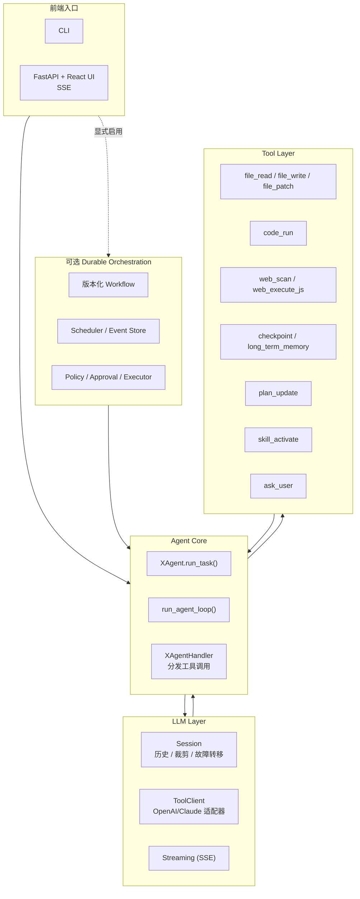
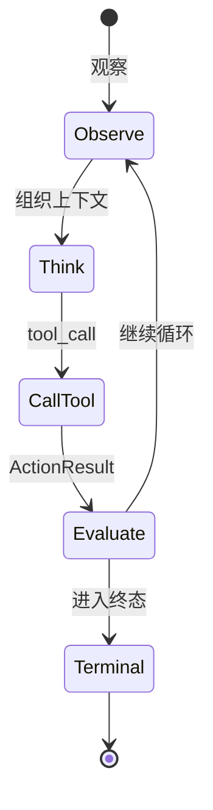
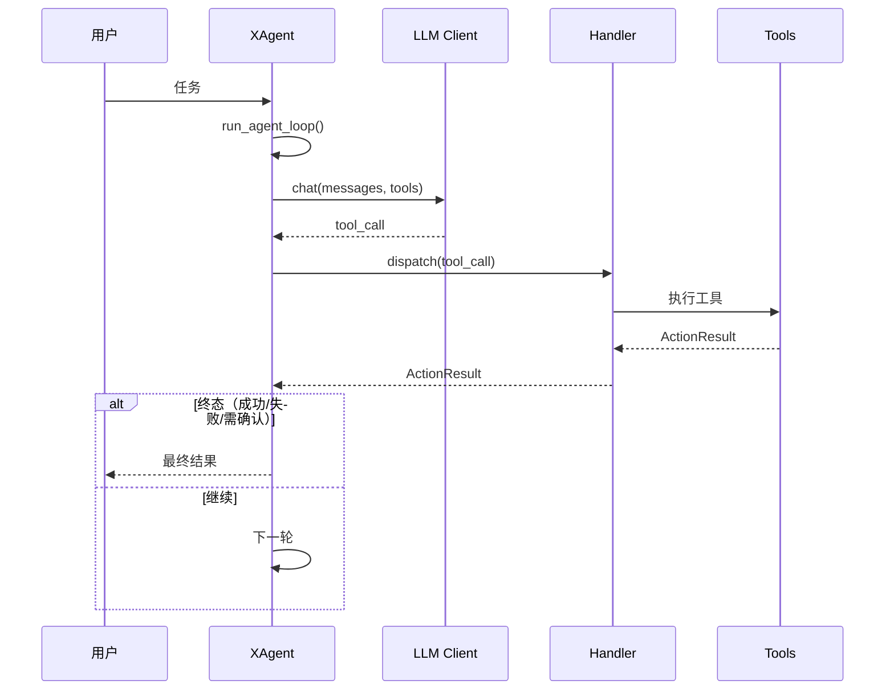

# XAgent 🤖

> 面向“真实环境操作”的物理执行 Agent 运行时：围绕工具调用闭环（tool-call loop）构建。
>
> **先观察 → 最小副作用执行 → 清晰暴露失败 → 循环直到产生可落地的终态结果。**

[](#-环境要求)
[](#-fastapi--react-界面)
[](#-项目状态)
[](#-许可证)

语言：[English](README.md) | 简体中文

---

## ✨ XAgent 是什么

XAgent 面向那些**必须触碰真实环境**的任务：

- 🗂️ 读取 / 写入 / patch 文件
- 🧪 执行 Python 或 shell 命令
- 🌐 扫描与控制浏览器
- 🙋 在关键节点向用户追问澄清
- 🧠 维护短期 checkpoint 与长期记忆

它刻意避免做成“聊天壳”。核心是一个持续迭代的 **工具调用闭环**：只要任务还没到达明确的终态（成功/失败/需要用户确认），就继续观察与行动。

---

## ✅ 亮点特性

- 🔁 **显式控制流**：每个工具返回统一的 `ActionResult`（数据、下一轮 prompt、退出意图、循环 flags）。
- 🧩 **多种模型协议**：既支持文本工具协议，也支持 OpenAI/Claude 的原生 tool-calling 客户端。
- 🧵 **会话级历史管理**：历史裁剪、流式解析、failover 都收敛在 LLM layer 内。
- 🛠️ **物理工具集**：文件读写、代码执行、浏览器 scan/JS、用户打断、checkpoint、长期记忆沉淀、skill 激活、计划跟踪。
- 🖥️ **流式前端**：CLI，以及 FastAPI + React（SSE 推送）。
- 📈 **可观测性**：结构化事件 sink、JSONL 日志、可选 Langfuse。
- 🧯 **本地优先 workspace 模型**：相对路径默认落在 workspace 内，降低误改仓库与系统文件的概率。

---

## 🧪 项目状态

XAgent 目前属于 **偏研究 + 工程探索的早期项目**：架构清晰、测试与前端入口齐全，也确实可运行；但公共 API 与配置格式仍可能演进。

⚠️ 由于它具备执行代码与修改文件的能力，请按 **实验性软件** 的安全等级来使用。

---

## 🧭 架构概览（图解）



### 🔄 工具调用闭环（状态视图）



### 🧵 主链路（时序视图）



设计文档在 [`docs/`](docs/)：

- [`docs/architecture.md`](docs/architecture.md)
- [`docs/agent-loop.md`](docs/agent-loop.md)
- [`docs/llm-layer.md`](docs/llm-layer.md)
- [`docs/tool-layer.md`](docs/tool-layer.md)
- [`docs/observability.md`](docs/observability.md)
- [`docs/outlines.md`](docs/outlines.md)
- [`docs/distributed-execution-adr.md`](docs/distributed-execution-adr.md)
- [`docs/distributed-execution-quickstart.md`](docs/distributed-execution-quickstart.md)

---

## 🧱 可选 Durable Orchestration 控制面

`src.orchestration` 是包裹现有 Agent Core 的显式可选控制面。仅导入该包不会启动
worker、创建存储，也不会改变默认 CLI、FastAPI、React 或 Team Workflow
行为。

它的小型顶层 API 提供以下主要组合入口：

- 不可变、内容寻址的 Artifact、有界 `ArtifactRef`，以及保守、可恢复的本地孤立
  Artifact 清理
- 版本化声明式 Workflow、DAG 调度、deadline、lease、fencing、暂停/取消/恢复，以及
  有界父子 Run
- 以 SQLite Domain Event 为事实、可重建的 projection
- policy、持久 approval 等待/恢复/拒绝与可信执行门禁
- 无副作用 replay、不变量/故障评测，以及基于显式证据的可靠性指标
- 无会话 MCP 2026-07-28 discovery 与编排工具；协议元数据和授权上下文均按请求校验；
  malformed、oversized、over-deep 输入使用独立的预解析 token budget，不消耗正常合法
  请求预算
- 无宿主路径、会话绑定的远程执行参考组合，包含 Artifact grant、签名 runtime
  proof、取消 receipt 与 replay 证据

高级适配器仍从各自的 `src.orchestration.<module>` 模块导入。顶层包刻意不导入 Web
projection，因此核心 API 不要求安装 FastAPI。

### 正确性边界

- Activity Attempt 采用 **at-least-once** 语义。Domain Event 与本地 projection
  原子提交，但外部副作用与 SQLite 不共享事务。
- 幂等或可从外部探测结果的操作可以复用稳定身份重试；无法确认结果的非幂等操作停在
  `OUTCOME_UNKNOWN` / `WAITING_RECOVERY`，禁止盲目重放。
- legacy `AgentActivity` 只把现有多轮 Agent Loop 保守地包装为一个 opaque Activity。
  其内部工具调用不会自动变成逐工具 verified receipt，因此中断后的 legacy Activity
  不能声称精确的工具级恢复。
- Runtime 创建的 Run 会持久化已验证的不可变 Workflow Artifact identity。Scheduler
  缓存丢失或进程重启后会重新验证并编译该精确定义；外部 resolver 只是覆盖能力，不是
  正确性依赖。定义字节缺失或身份不匹配时 fail closed。
- `(workflow_id, workflow_version)` 在整个 Store 中只能绑定一个不可变定义 digest，
  低层 API 和子 Run 创建也不能绕过。Workflow v2 的输入映射把 Run/上游 Artifact
  identity 精确绑定到 Activity 请求，join 顺序保持确定。
- `REQUIRE_APPROVAL` 会释放 worker lease，并把同一 Attempt 持久停在等待状态。可信
  grant 以更高 fencing token 重新调度；拒绝或取消在不调用 backend 的前提下终止。
- XAgent **不承诺**任意工具 exactly-once、外部系统自动回滚、分布式共识，或进程 /
  provider / 浏览器内部状态的精确恢复。
- 远程参考实现按 Run 轮询且仅在进程内组合：它不是生产 server/pull transport、
  真实 mTLS、gVisor 或异构 fleet 集成；prepared execution 与 staged output registry
  也只存在于进程内。OCI/HMAC 证据只证明绑定与校验，不证明生产 sandbox 隔离。fleet
  claim 在准入后失败时，必须先从 Store 重新投影再分配。
- checkpoint 摘要与 telemetry 是有用的 projection，不是执行事实；大型或敏感内容只能
  通过经过审查的 Artifact 引用跨越控制面。
- Event Store、Artifact 根、GC 隔离区和锁必须位于所有 Agent 可写 workspace 之外，
  由独立控制面服务/OS identity 持有，且不得挂载给 legacy 文件、代码或浏览器工具。
  默认 Web UI 不会自动挂载 Durable 数据库；GET-only Web adapter 只接受显式的受信
  tenant→database resolver，用于独立部署的投影服务。隐藏路径或同 UID 权限不是安全
  边界。
- 可信 Executor 会在 backend 执行前拒绝与 Store 或 Artifact 根重叠的 Sandbox
  `cwd`/allowed root。该组合防护用于阻止危险挂载配置，但不能替代 OS/container
  隔离。
- 持久化 Run、Node、Attempt 和 Artifact metadata 会在 Unicode / 大小写 / 分隔符
  规范化后递归拒绝凭据形态的键。系统直接失败，不会静默脱敏并造成身份碰撞；敏感内容
  必须进入受保护 Artifact。
- 本地 Artifact 清理默认仅预览，只把已提交的完整 `ArtifactRef` 视为可达引用。Store
  schema v3 在同一个 Domain Event 事务内登记 canonical 引用，并与持久化的逐对象 GC
  claim 线性化，因此新提交的引用不会指向已隔离的内容。最小 grace period、清理前二次
  可达性扫描、跨进程 GC 锁和同文件系统隔离区使清理保持保守且可恢复；该保证不覆盖
  `DurableRunStore` Event 事务之外的任意外部登记。超过 grace 的崩溃写入临时文件也
  共用该锁和有界隔离流程；收集器不会 unlink 隔离内容，最终保留期由运维策略显式决定。
- hierarchy 子 Run 使用带索引、有上限的 Store 查询。Web 详情与 SSE snapshot 对
  Run/Node/Attempt projection 使用同一个 SQLite snapshot，并实施分页和响应硬上限；
  常规页面不会为每个 Run 重放完整 Event History，全量 replay 校验由显式的单 Run
  integrity endpoint 提供。该运维端点只有在 router 显式注入 authorizer 后才可访问；
  流式 reducer 与 live projection 比较共享同一个 SQLite read snapshot，并同时限制
  Event 总数、canonical payload 累计字节数和协作式 wall-time。

组合部署前，请先阅读[设计规范](docs/durable-orchestration-spec.md)，运行
[本地 quickstart](docs/durable-orchestration-quickstart.md)或
[分布式参考 quickstart](docs/distributed-execution-quickstart.md)，并检查
[故障矩阵](docs/durable-orchestration-fault-matrix.md)。

最小可运行组合：

```bash
.venv/bin/python examples/orchestration_runtime_minimal.py
```

---

## 🗺️ 仓库结构

```text
XAgent/
├── src/
│   ├── core/                 # agent loop、LLM clients、telemetry、skills
│   ├── orchestration/        # 可选持久编排控制面
│   ├── handler/              # XAgentHandler：工具调用分发
│   ├── tools/                # 无状态工具实现
│   ├── assets/               # system prompt、tool schema、code-run header
│   ├── main.py               # CLI 入口
│   └── web_ui_new.py         # FastAPI 后端（服务 React UI）
├── frontends/web/            # React + Vite 前端
├── docs/                     # 设计文档
├── memory/                   # 持久化记忆与 SOP
├── reflect/                  # reflection 工具
├── skills/                   # 本地 prompt skill 包
├── tests/                    # unittest 测试
├── pyproject.toml
└── uv.lock
```

运行时产物通常落在 `workspace/`、`temp/` 与日志目录（默认应被 Git 忽略）。

---

## 📦 环境要求

- Python `>=3.12,<3.13`
- 推荐使用 [`uv`](https://docs.astral.sh/uv/) 管理 Python 环境
- Node.js + npm（用于 React 前端）
- 使用 Selenium 浏览器工具时需要 Chrome/Chromium
- 一个 OpenAI-compatible 或 Claude-compatible 的模型服务端点

---

## 🚀 快速开始

### 1）安装

创建 Python 环境：

```bash
uv sync
```

安装可选 web/browser 依赖：

```bash
uv sync --extra web
```

### 2）配置

最简单的方式是通过环境变量：

```bash
export OPENAI_API_KEY="..."
export OPENAI_BASE_URL="https://api.openai.com/v1/chat/completions"
export OPENAI_MODEL="gpt-4o"
```

`code_run` 默认逐次请求用户确认。可在受控环境中显式配置：

```bash
export XAGENT_CODE_RUN_POLICY="confirm"  # confirm | deny | allow
export XAGENT_OUTSIDE_READ_POLICY="confirm"  # confirm | deny | allow
export XAGENT_CHROME_PAGE_LOAD_TIMEOUT="30"  # 1..120 秒
```

代码执行的 `allow` 表示接受未使用 OS 文件系统沙箱的风险；工作区外读取默认逐次确认。无论策略为何，子进程都不会继承模型密钥等宿主敏感环境变量。Chrome 默认保留沙箱，只有受控部署显式设置 `XAGENT_CHROME_NO_SANDBOX=1` 才会关闭。Web 服务只接受本地 Host；如需自定义本地域名，使用逗号分隔的 `XAGENT_WEB_ALLOWED_HOSTS` 显式加入。

也可以提供 JSON 配置文件（支持 OpenAI/Claude 的 text 模式、原生 tools 模式、以及 failover mixin）。

**建议：** 不要把密钥提交到仓库。可维护一个 `config.example.json` 用于示例与共享。

### 3）运行（CLI）

```bash
.venv/bin/python -m src.main
```

常用 CLI 命令：

```text
/help
/session.temperature=0.5
/session.max_tokens=8192
/verbose on
/stop
/exit
```

---

## 🧩 FastAPI + React 界面

### 一次构建，后端托管

```bash
cd frontends/web
npm install
npm run build
cd ../..
.venv/bin/python -m src.web_ui_new --host 127.0.0.1 --port 7861
```

打开：

```text
http://127.0.0.1:7861/
```

Web UI 仅接受回环客户端。内置前端使用同源访问，本地 Vite 开发默认允许
`http://127.0.0.1:5173` 和 `http://localhost:5173`。如需增加其他本地
开发 Origin，启动前显式配置完整地址：

```bash
XAGENT_WEB_ALLOWED_ORIGINS=http://127.0.0.1:4173 \
  .venv/bin/python -m src.web_ui_new --host 127.0.0.1 --port 7861
```

通配符 Origin 会被忽略。远程使用时应保持后端监听回环地址，并通过 SSH
隧道访问。

### 前端开发模式（Vite）

```bash
.venv/bin/python -m src.web_ui_new --host 127.0.0.1 --port 7861
cd frontends/web
VITE_API_BASE=http://127.0.0.1:7861 npm run dev -- --host 127.0.0.1 --port 5173
```

---

## 🧰 工具（Tools）

工具行为定义位于 [`src/assets/tools_schema.json`](src/assets/tools_schema.json)。

<table header-row="true" header-col="false" col-widths="180,820">
  <tr>
    <td>域</td>
    <td>工具</td>
  </tr>
  <tr>
    <td>代码执行</td>
    <td><code>code_run</code></td>
  </tr>
  <tr>
    <td>文件操作</td>
    <td><code>file_read</code>, <code>file_write</code>, <code>file_patch</code></td>
  </tr>
  <tr>
    <td>浏览器操作</td>
    <td><code>web_scan</code>, <code>web_execute_js</code></td>
  </tr>
  <tr>
    <td>用户交互</td>
    <td><code>ask_user</code></td>
  </tr>
  <tr>
    <td>记忆与计划</td>
    <td><code>update_working_checkpoint</code>, <code>start_long_term_update</code>, <code>plan_update</code></td>
  </tr>
  <tr>
    <td>技能包</td>
    <td><code>skill_activate</code></td>
  </tr>
</table>

---

## 🧯 Workspace 与安全模型

默认情况下，XAgent 使用 `<project_root>/workspace` 作为物理 workspace，相对路径都会在 workspace 下解析。

高层安全约束（概念层）：

- 文件操作会校验 workspace 边界
- `file_patch` 要求 `old_content` **精确且唯一匹配**
- 代码执行运行在子进程内，并带超时
- 工具输出在回注入模型上下文前会被截断
- 长任务可通过 `/stop` 或 UI 停止按钮中断

---

## 📈 可观测性（Observability）

开启 JSONL 日志：

```bash
export XAGENT_LOG_DIR=logs
export XAGENT_LOG_STDERR=1
```

可选 Langfuse：

```bash
uv sync --extra observability
.venv/bin/python -m src.main --observability-config observability.example.json
```

---

## 🧠 Skills（本地技能包）

本地技能包是 prompt 指令集合（**不会**注册新的可执行工具）。

默认目录是 [`skills/`](skills/)，每个 skill 通常包含：

```text
SKILL.md
_meta.json
```

指定自定义 skills 目录：

```bash
.venv/bin/python -m src.main --skills-dir skills
```

---

## 🧪 测试

运行 Python 测试：

```bash
.venv/bin/python -m unittest discover -s tests
```

前端检查：

```bash
cd frontends/web
npm run build
npm run lint
```

---

## 🗓️ Roadmap（方向清单）

- ✅ 可复现的 Python 与前端质量门禁
- 🧪 版本化 Agent 能力基准与回归预算
- 🧠 可量化的检索、上下文与审核后记忆质量
- 🛡️ 面向 operator 的策略模拟与审批证据
- 🌐 超越 reference adapter 的可部署持久 Worker 传输
- 📦 可复现的打包、升级与 showcase 流程

详见证据驱动的 [Agent Platform Roadmap](docs/agent-platform-roadmap.md)
与离线 [Eval 回归门禁契约](docs/eval-regression-gates.md)。

---

## 🤝 贡献指南

欢迎贡献：

- 只改必须改的，保持最小 diff。
- 修改循环引擎、工具契约、协议适配前，先阅读 `docs/`。
- 影响 loop exit、history、tool contract、path safety、streaming、event delivery 的改动必须补测试。

建议先开 issue 讨论较大改动。

---

## 📄 许可证

本项目采用 **MIT License** 开源协议，详见 [`LICENSE`](LICENSE)。

---

## 🙏 致谢

本项目受到现代 Agent runtime 与 tool-calling 生态的启发（如 LangChain、AutoGen 及更广泛的开源 LLM 工具链）。

<!-- 📸 可选：后续可在这里加入截图/GIF，让 README 更“图文并茂” -->
<!-- 示例：


-->
