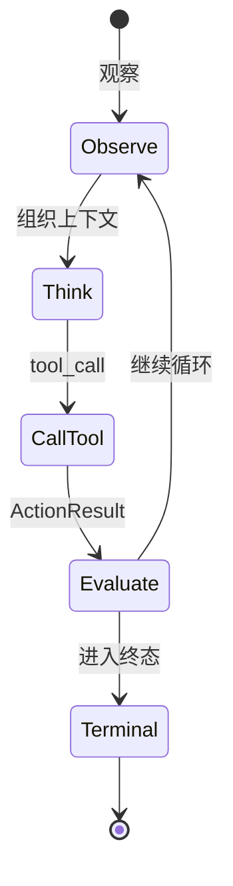
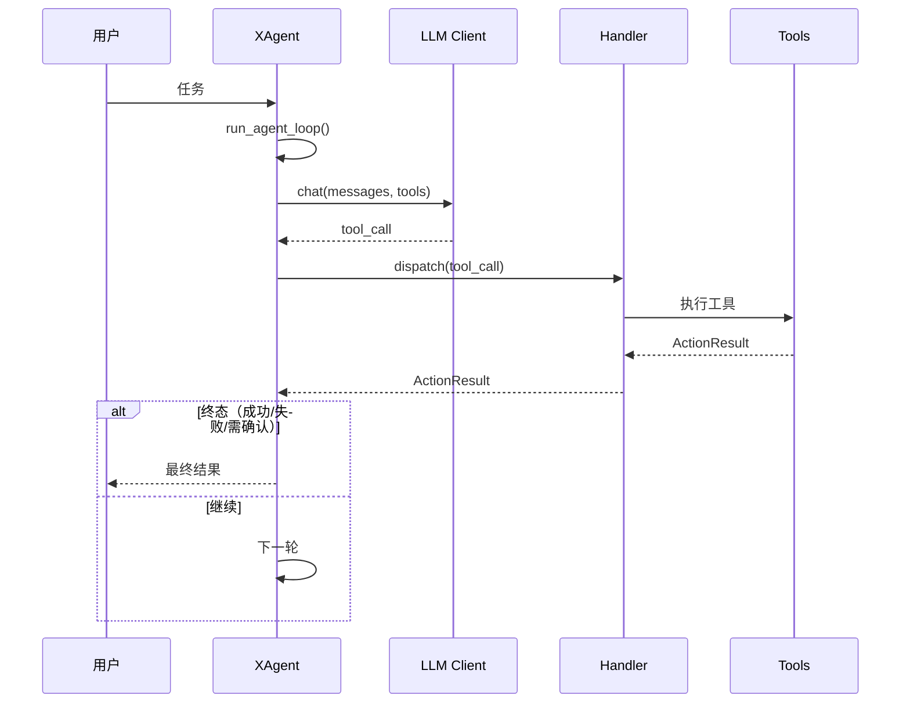

# XAgent 🤖

> 面向“真实环境操作”的物理执行 Agent 运行时：围绕工具调用闭环（tool-call loop）构建。
>
> **先观察 → 最小副作用执行 → 清晰暴露失败 → 循环直到产生可落地的终态结果。**

[](#-环境要求)
[](#-fastapi--react-界面)
[](#-项目状态)
[](#-许可证)

---

## ✨ XAgent 是什么

XAgent 面向那些**必须触碰真实环境**的任务：

- 🗂️ 读取 / 写入 / patch 文件
- 🧪 执行 Python 或 shell 命令
- 🌐 扫描与控制浏览器
- 🙋 在关键节点向用户追问澄清
- 🧠 维护短期 checkpoint 与长期记忆

它刻意避免做成“聊天壳”。核心是一个持续迭代的 **工具调用闭环**：只要任务还没到达明确的终态（成功/失败/需要用户确认），就继续观察与行动。

---

## ✅ 亮点特性

- 🔁 **显式控制流**：每个工具返回统一的 `ActionResult`（数据、下一轮 prompt、退出意图、循环 flags）。
- 🧩 **多种模型协议**：既支持文本工具协议，也支持 OpenAI/Claude 的原生 tool-calling 客户端。
- 🧵 **会话级历史管理**：历史裁剪、流式解析、failover 都收敛在 LLM layer 内。
- 🛠️ **物理工具集**：文件读写、代码执行、浏览器 scan/JS、用户打断、checkpoint、长期记忆沉淀、skill 激活、计划跟踪。
- 🖥️ **流式前端**：CLI、Gradio，以及 FastAPI + React（SSE 推送）。
- 📈 **可观测性**：结构化事件 sink、JSONL 日志、可选 Langfuse。
- 🧯 **本地优先 workspace 模型**：相对路径默认落在 workspace 内，降低误改仓库与系统文件的概率。

---

## 🧪 项目状态

XAgent 目前属于 **偏研究 + 工程探索的早期项目**：架构清晰、测试与前端入口齐全，也确实可运行；但公共 API 与配置格式仍可能演进。

⚠️ 由于它具备执行代码与修改文件的能力，请按 **实验性软件** 的安全等级来使用。

---

## 🧭 架构概览（图解）

```mermaid
flowchart TB
  subgraph F[前端入口]
    CLI[CLI]
    Gradio[Gradio UI]
    Web[FastAPI + React UI<br/>SSE]
  end

  subgraph C[Agent Core]
    X[XAgent.run_task()]
    Loop[run_agent_loop()]
    Handler[XAgentHandler<br/>分发工具调用]
  end

  subgraph L[LLM Layer]
    Session[Session<br/>历史 / 裁剪 / 故障转移]
    ToolClient[ToolClient<br/>OpenAI/Claude 适配器]
    Stream[Streaming (SSE)]
  end

  subgraph T[Tool Layer]
    File[file_read / file_write / file_patch]
    Code[code_run]
    WebTool[web_scan / web_execute_js]
    Memory[checkpoint / long_term_memory]
    Plan[plan_update]
    Skill[skill_activate]
    Ask[ask_user]
  end

  F --> C
  C --> L
  L --> C
  C --> T
  T --> C
```

### 🔄 工具调用闭环（状态视图）



### 🧵 主链路（时序视图）



设计文档在 [`docs/`](docs/)：

- [`docs/architecture.md`](docs/architecture.md)
- [`docs/agent-loop.md`](docs/agent-loop.md)
- [`docs/llm-layer.md`](docs/llm-layer.md)
- [`docs/tool-layer.md`](docs/tool-layer.md)
- [`docs/observability.md`](docs/observability.md)
- [`docs/outlines.md`](docs/outlines.md)

---

## 🗺️ 仓库结构

```text
XAgent/
├── src/
│   ├── core/                 # agent loop、LLM clients、telemetry、skills
│   ├── handler/              # XAgentHandler：工具调用分发
│   ├── tools/                # 无状态工具实现
│   ├── assets/               # system prompt、tool schema、code-run header
│   ├── main.py               # CLI 入口
│   ├── web_ui.py             # Gradio UI
│   └── web_ui_new.py         # FastAPI 后端（服务 React UI）
├── frontends/web/            # React + Vite 前端
├── docs/                     # 设计文档
├── memory/                   # 持久化记忆与 SOP
├── reflect/                  # reflection 工具
├── skills/                   # 本地 prompt skill 包
├── tests/                    # unittest 测试
├── pyproject.toml
└── uv.lock
```

运行时产物通常落在 `workspace/`、`temp/` 与日志目录（默认应被 Git 忽略）。

---

## 📦 环境要求

- Python `>=3.12,<3.13`
- 推荐使用 [`uv`](https://docs.astral.sh/uv/) 管理 Python 环境
- Node.js + npm（用于 React 前端）
- 使用 Selenium 浏览器工具时需要 Chrome/Chromium
- 一个 OpenAI-compatible 或 Claude-compatible 的模型服务端点

---

## 🚀 快速开始

### 1）安装

创建 Python 环境：

```bash
uv sync
```

安装可选 web/browser 依赖：

```bash
uv sync --extra web
```

### 2）配置

最简单的方式是通过环境变量：

```bash
export OPENAI_API_KEY="..."
export OPENAI_BASE_URL="https://api.openai.com/v1/chat/completions"
export OPENAI_MODEL="gpt-4o"
```

也可以提供 JSON 配置文件（支持 OpenAI/Claude 的 text 模式、原生 tools 模式、以及 failover mixin）。

**建议：** 不要把密钥提交到仓库。可维护一个 `config.example.json` 用于示例与共享。

### 3）运行（CLI）

```bash
.venv/bin/python -m src.main
```

常用 CLI 命令：

```text
/help
/session.temperature=0.5
/session.max_tokens=8192
/verbose on
/stop
/exit
```

---

## 🧩 FastAPI + React 界面

### 一次构建，后端托管

```bash
cd frontends/web
npm install
npm run build
cd ../..
.venv/bin/python -m src.web_ui_new --host 127.0.0.1 --port 7861
```

打开：

```text
http://127.0.0.1:7861/
```

### 前端开发模式（Vite）

```bash
.venv/bin/python -m src.web_ui_new --host 127.0.0.1 --port 7861
cd frontends/web
VITE_API_BASE=http://127.0.0.1:7861 npm run dev -- --host 127.0.0.1 --port 5173
```

---

## 🎛️ Gradio 界面

```bash
.venv/bin/python -m src.web_ui --host 127.0.0.1 --port 7860
```

---

## 🧰 工具（Tools）

工具行为定义位于 [`src/assets/tools_schema.json`](src/assets/tools_schema.json)。

<table header-row="true" header-col="false" col-widths="180,820">
  <tr>
    <td>域</td>
    <td>工具</td>
  </tr>
  <tr>
    <td>代码执行</td>
    <td><code>code_run</code></td>
  </tr>
  <tr>
    <td>文件操作</td>
    <td><code>file_read</code>, <code>file_write</code>, <code>file_patch</code></td>
  </tr>
  <tr>
    <td>浏览器操作</td>
    <td><code>web_scan</code>, <code>web_execute_js</code></td>
  </tr>
  <tr>
    <td>用户交互</td>
    <td><code>ask_user</code></td>
  </tr>
  <tr>
    <td>记忆与计划</td>
    <td><code>update_working_checkpoint</code>, <code>start_long_term_update</code>, <code>plan_update</code></td>
  </tr>
  <tr>
    <td>技能包</td>
    <td><code>skill_activate</code></td>
  </tr>
</table>

---

## 🧯 Workspace 与安全模型

默认情况下，XAgent 使用 `<project_root>/workspace` 作为物理 workspace，相对路径都会在 workspace 下解析。

高层安全约束（概念层）：

- 文件操作会校验 workspace 边界
- `file_patch` 要求 `old_content` **精确且唯一匹配**
- 代码执行运行在子进程内，并带超时
- 工具输出在回注入模型上下文前会被截断
- 长任务可通过 `/stop` 或 UI 停止按钮中断

---

## 📈 可观测性（Observability）

开启 JSONL 日志：

```bash
export XAGENT_LOG_DIR=logs
export XAGENT_LOG_STDERR=1
```

可选 Langfuse：

```bash
uv sync --extra observability
.venv/bin/python -m src.main --observability-config observability.example.json
```

---

## 🧠 Skills（本地技能包）

本地技能包是 prompt 指令集合（**不会**注册新的可执行工具）。

默认目录是 [`skills/`](skills/)，每个 skill 通常包含：

```text
SKILL.md
_meta.json
```

指定自定义 skills 目录：

```bash
.venv/bin/python -m src.main --skills-dir skills
```

---

## 🧪 测试

运行 Python 测试：

```bash
.venv/bin/python -m unittest discover -s tests
```

前端检查：

```bash
cd frontends/web
npm run build
npm run lint
```

---

## 🗓️ Roadmap（方向清单）

- 🔐 为高风险工具引入更强的权限模型
- 🧪 更完整的前端测试体系
- 🧰 增加 CI（Python unittest + 前端 build/lint）
- 📦 增加可发布的 release workflow
- 🧾 提供更完善的配置示例与最佳实践

---

## 🤝 贡献指南

欢迎贡献：

- 只改必须改的，保持最小 diff。
- 修改循环引擎、工具契约、协议适配前，先阅读 `docs/`。
- 影响 loop exit、history、tool contract、path safety、streaming、event delivery 的改动必须补测试。

建议先开 issue 讨论较大改动。

---

## 📄 许可证

本项目采用 **MIT License** 开源协议，详见 [`LICENSE`](LICENSE)。

---

## 🙏 致谢

本项目受到现代 Agent runtime 与 tool-calling 生态的启发（如 LangChain、AutoGen 及更广泛的开源 LLM 工具链）。

<!-- 📸 可选：后续可在这里加入截图/GIF，让 README 更“图文并茂” -->
<!-- 示例：


-->